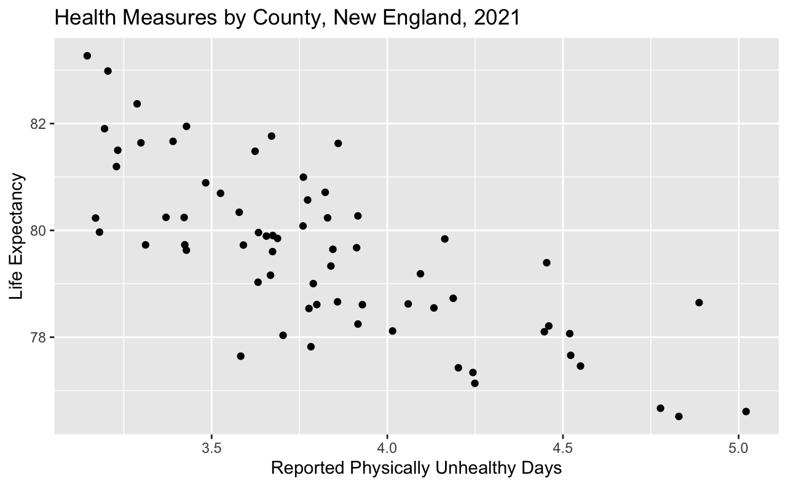

```{r, include=FALSE}
# Do not edit this code chunk
knitr::opts_chunk$set(echo = TRUE, message=FALSE, warning = FALSE)
```

# Today's Dataset

Today we will be working with a data resource from the University of Wisconsin Population Health Institute. It aggregates data from a number of government sources to produce county health indicators for every county in the US.

Run the code below to load the dataset we will be working with today. 

```{r}
library(tidyverse)
read_file = readLines("data/county_health_2021.csv")
county_health_2021 <- read.csv(textConnection(read_file[-2]), header = TRUE, sep=",") 
rm(read_file)

county_health_2021 <-
  county_health_2021 |>
  rename_all(~str_replace_all(.,"\\.","_")) |>
  rename_all(~str_replace_all(.,"___","_")) |>
  filter(State_FIPS_Code != 00 & County_FIPS_Code != 0) |>
  select(State_FIPS_Code:Release_Year, ends_with("value"), -starts_with("X"))

ne_county_health_2021 <- county_health_2021 |>
  filter(State_Abbreviation %in% c("MA", "RI", "CT", "VT", "NH", "ME"))
```

# View the Data

```{r}
# Write your code below


```

# Overplotting

When we have so much overlapping data represented on a plot that it becomes difficult to draw any conclusions from it. Run the code below to see an example of this.

```{r}
ggplot(data = county_health_2021, 
       aes(x = Children_in_poverty_raw_value, 
           y = Math_scores_raw_value)) +
  geom_point() +
  labs(title = "Health Measures in the US, 2021",
       x = "Children in Poverty Measure", 
       y = "Math Scores Measure") +
  theme_minimal() +
  theme(legend.position = "bottom")
```

Fortunately, there are some adjustments we can make to deal with overplotting. First, we can adjust the transparency of the shapes on our plot by setting the *alpha* argument in our geom function to a number between 0 and 1. We can also reduce the size of the shapes on our plot by setting the *size* argument in our geom function to a number between 0 and 1. 

## Exercise 1: Adjust the Alpha and Size of Points on Plot

Copy and paste the code I created above into the chunk below. In the `geom_point()` function, set the *alpha* to 0.75 and the *size* to 0.5. Notice the adjustments to the plot as you update these attributes. 

```{r}
# Paste the code below and adjust it

```

**Reflection**: What conclusions would you draw from this plot?

**Answer**:

Let's look at another example of overplotting. Run the code below and review the plot.

```{r}
ggplot(data = ne_county_health_2021, 
       aes(x = State_Abbreviation, 
           y = Flu_vaccinations_raw_value)) +
  geom_point() +
  labs(title = "Flu Vaccination Measure by County, New England, 2021",
       x = "State", 
       y = "Flu Vaccination Measure") +
  theme_minimal()
```

While it may look fine at first glance, it turns out that some counties have the exact same flu vaccination measure and are overlapping each other on that plot. We could add an *alpha* argument to see where there are overlaps.

```{r}
# Paste the code below and adjust it

```

However, in this case, to be sure that every county is represented on the plot, a better option, would be to add *jitter* to the plot. *jitter* offsets the points from their original position slightly so that we can make out points that overlap.

## Exercise 2: Add Jitter to the Plot

Copy the code that I created above into the chunk below. Refer to the [ggplot2 cheatsheet](https://github.com/rstudio/cheatsheets/blob/main/data-visualization-2.1.pdf) to find the geom function you need to create this plot. Set the *width* and the *height* of the *jitter* to your choice. Notice the adjustments to the plot as you update these attributes.

```{r}
# Paste the code below and adjust it

```

**Reflection**: Which New England states have counties with the highest flu vaccination rates? In which states are there greater disparities in vaccination rates across counties?

**Answer**:

# Graphics

## Exercise 3: Recreate This Image Using the `ggplot()` Function

(Full size image in the images folder.)



```{r}
# Write your code below

```

## Exercise 4: Add a Subtitle to This Plot and Set the Theme to *Minimal* to Balance the Data-to-ink Ratio

Your subtitle should be the data's source: County Health Rankings, University of Wisconsin Population Health Institute

```{r}
# Paste the code below and adjust it

```

## Exercise 5: Divide This Plot by State

Sometimes, the narrative a plot conveys can be misleading until we starting layering in additional variables. For instance, in the above plot we look at the correlation between life expectancy and reported physically unhealthy days in New England counties, but different states in New England might have different relationships between the two variables, so it may make more sense to divide this plot out by state. We can do this by creating small multiples using the `facet_wrap()` function. 

```{r}
# Paste the code you wrote in Exercise 4 below and adjust it

```

## Exercise 6: Adjust the Scale and Position of Plot

When we map a variable onto an aesthetic, we are only indicating that the variable should be mapped. We are not indicating how the variable should be mapped. In order to indicate how we want a variable mapped to an aesthetic, we can adjust its scales. Scales are adjusted by tacking the following onto a `ggplot()` object: `+ scale_*_<type>()`. For instance, let’s say that I wanted to adjust the scale of my x-axis to a log scale. I would attach `+ scale_x_log10()` to my `ggplot()` object.

We can adjust the scale of our x and y-axes by adding `+ scale_x_<type>()` or `+ scale_y_<type>()` to our plots. Note what happens when we attempt to create a scatterplot that shows the relationship between all the counties in the US and the HIV prevalence measure. Run the code below to see an example of this.

```{r}
ggplot(data = county_health_2021, 
       aes(x = State_FIPS_Code, 
           y = HIV_prevalence_raw_value)) +
  geom_point() +
  scale_y_continuous() +
  scale_x_continuous(breaks = seq(1,56,2)) + # increase number of x axis ticks
  labs(title = "Health Measures in the US, 2021",
       x = "State Code", 
       y = "HIV Prevalence Measure") +
  theme_minimal() +
  theme(axis.text.x = element_text(size = 7)) # reduce the text size of x axis labels
```

Even if we adjust the *alpha* and *size* of points on the plot as we did in Exercise 1, as well as use another method to add *jitter* to the plot, which is to set `position = position_jitter()` in the `geom_point()` function, the plot is still difficult to interpret. Run the code below to see an example of this.

```{r}
ggplot(data = county_health_2021, 
       aes(x = State_FIPS_Code, 
           y = HIV_prevalence_raw_value)) +
  geom_point(alpha = 0.5, 
             size = 0.1, 
             position = position_jitter(width = 0.15,
                                        height = 0)) +
  scale_y_continuous() +
  scale_x_continuous(breaks = seq(1,56,2)) +
  labs(title = "Health Measures in the US, 2021",
       x = "State Code", 
       y = "HIV Prevalence Measure") +
  theme_minimal() +
  theme(axis.text.x = element_text(size = 7))
```

Due to most states have fewer than 1,000 people newly diagnosed with HIV in 2021, the vast majority of the points on the plot appear at the bottom of the y-axis scale and are indiscernible from one another. This is a case when it makes sense to apply a log scale to the y-axis.

Copy the plot that I created above, and change the y-axis scale from continuous to log10. You might reference the formula specified above or reference the [ggplot2 cheatsheet](https://github.com/rstudio/cheatsheets/blob/main/data-visualization-2.1.pdf) for help. 

```{r}
# Paste the code below and adjust it

```
